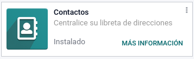
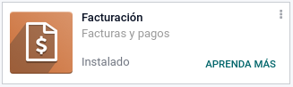
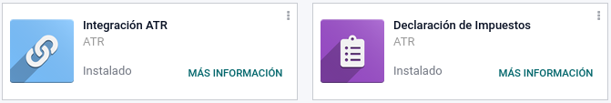
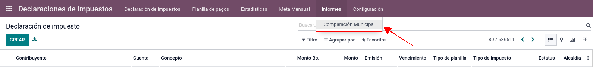
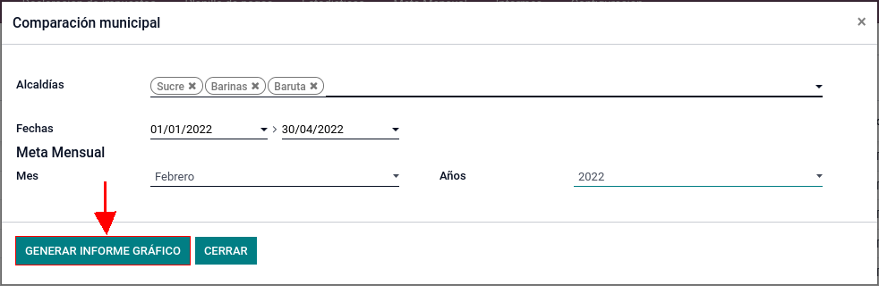

=========
Alcaldía
=========

Éste es un módulo desarrollado para generar un informe que contiene datos estadísticos de ventas de un producto sobre las alcaldías seleccionadas, facilitando así el análisis de dichos datos.

**Tabla de contenido**

.. contents::
  :local:

Instalación
===========

Primero se debe tener instalado los siguientes módulos:

- **Conversaciones**

- **Contactos**

- **Facturación**

- **Sitio Web**

- Por último los módulos de **Integración ATR** y **Declaración de Impuestos**

¿Cómo generar el informe?
===========================

Luego de tener los módulos correspondientes instalados, se debe acceder al de *"Declaración de Impuestos"*.

Dentro de este módulo en la parte superior se selecciona la pestaña de *"Informes"* seguido de *"Comparación Municipal"* como se muestra a continuación:

Aquí se desplegará una pantalla en la que se deben llenar los campos necesarios, luego por medio del botón *"GENERAR INFORME GRÁFICO"* se descargará el informe en formato *"PDF"*.

**El informe generado tendrá las siguientes secciones:**

1. Recaudación mensual por municipio (Bs): A partir del número de alcaldías y las fechas con las cuales se quiere ver la recaudación mensual, se va a generar la primera tabla y la gráfica con los valores correspondientes a cada alcaldía.

2. Recaudación VS Meta mensual (Bs): Al llenar los campos de *"Mes"* y *"Años"* se genera la grafica y la tabla correspondiente con las columnas *"Estimado"*, *"Recaudado"*, *"Pendiente"* y *"%Logrado"*.

3. Recaudación mensual expresada en dólares (según el tipo de cambio promedio del mes).

**Explicación de los campos para generar el informe:**

- Alcaldías: Se despliega una lista con todas las alcaldias registradas en sistema, se seleccionan las de interés para visualizarlas en el reporte.

- Fechas: Se selecciona una fecha de inicio y de fin para que por medio del wizard se calcule la recaudación por mes dentro del rango seleccionado.

	- **Nota:** Hay que tener cuidado con la selección de fechas ya que si elige una en la que no tiene datos la alcaldía no se puede generar el reporte.

- Mes: Se elige un mes en específico con el cual quiera consultar la meta mensual dentro del año correspondiente.

- Años: Despliega un menú con el cual se puede seleccionar desde el año actual hasta 10 años adelante

Créditos
========

Autor
~~~~~

* Franyer Hidalgo VE <fhidalgo.dev@gmail.com>

Contribuyentes
~~~~~~~~~~~~~~

* Alejandro Yende VE <alyendedev@gmail.com>
* Johan Morey VE <johan.alex1030@gmail.com>
* Gabriel Antunez VE <antunezgabrielc32@gmail.com>
* Moiśes Sira VE <msira270997@gmail.com>
